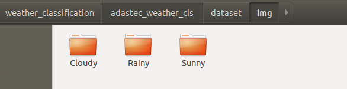
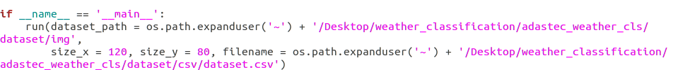
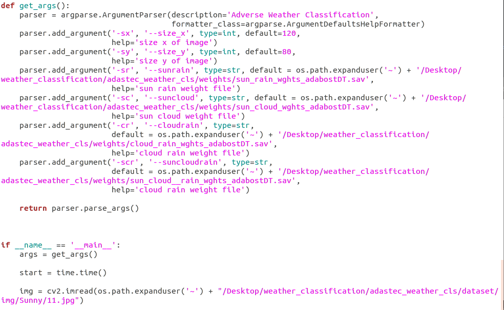
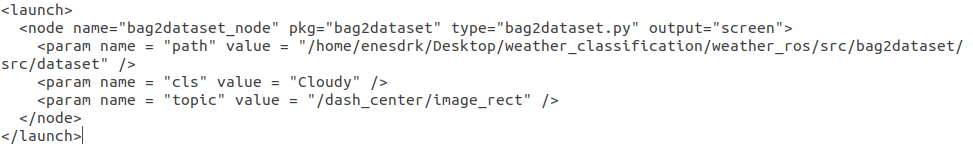

# **TRAINING**

First put the image dataset under adastec_weather_cls/dataset/img folder.



In the second stage, feature extraction will be done. Feature extraction should be saved in CSV format. If it is not saved in CSV format, the feature extraction process is repeated for each model.



Check the file path is correct.

For feature extraction;
```
  python adastec_weather_cls/process/feature_extractor.py
```

Under the train test folder, there are cloud-rain, sun-cloud, sun-rain training files for binary classification. For model training, these models need to be trained one by one.


You can modify the hyperparameters before training the models. Pay attention to the file paths used in this section.

To train the models;
```
  python adastec_weather_cls/train_test/cloud_rain_cls.py
  python adastec_weather_cls/train_test/sun_cloud_cls.py
  python adastec_weather_cls/train_test/sun_rain_cls.py
```

# **TESTING**

After the model training is done, the weight file of each model is saved under the adastec_weather_cls/weights folder. If you want to test the classifiers separately, you can run the test files under the adastec_weather_cls/train_test folder.

To test the models;
```
  python adastec_weather_clstrain_test/cloud_rain_test.py
  python adastec_weather_clstrain_test/sun_cloud_test.py
  python adastec_weather_clstrain_test/sun_rain_test.py
```
(Pay attention to the file paths in the code)

The adastec_weather_cls/main.py file is used to test the 3 classes using the binary classification mentioned in the article.



You can change the hyperparameters in the main file. You can also change the file paths from this section.

To run the binary classifier;
```
  python adastec_weather_cls/main.py
```

# **ROS**

The bag2dataset package is used to convert the bag file to a data set. There is a separate launch file for each weather condition.



From the launch file, you can write the path to the folder to be saved, the class name and the publisher topic name.

To run the launch files;
(when under weather_ros folder)
```
  roslaunch bag2dataset bag2dataset_cloudy.launch 
  roslaunch bag2dataset bag2dataset_sunny.launch 
  roslaunch bag2dataset bag2dataset_raıny.launch 
```

A classification package was created to test the model in real time. There is adastec_classification.launch file in the weather_ros/src/classification/launch folder.


You can change the parameters from the launch file. At the same time, the file path of the weight files used must be entered correctly.

For real-time testing;
```
  roslaunch classification adastec_classification.launch 
```

**WARNING: Make sure the file paths are correct.**

